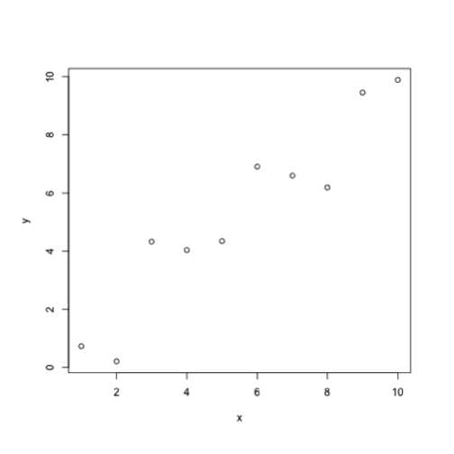

<!-- README.md is generated from README.Rmd. Please edit that file and call `knitr::knit('README.Rmd')` within the top directory. -->


digitize : a plot digitizer in R
===============

This is a fork of [digitize](https://github.com/tpoisot/digitize), an R package to manually extract data from graphs. It has been modified to streamline extraction of multiple figures with similar structure.

## Install

You must have `devtools` installed:


```r
if(!require(devtools)) install.packages('devtools')
devtools::install_github("east-winds/digitize")
```


## How to use


```r
library(digitize)

## make a temporary image
tmp <- tempfile()
png(tmp)
plot(rnorm(10) + 1:10, xlab="x", ylab="y",
     xlim=c(0,10),ylim=c(0,10), xaxs="i", yaxs="i")
dev.off()
#> RStudioGD
#>         2

## digitize figure using calibration twopoints=T and pre-specifying x-axis
#		(for example: digitizing multiple plots with same x-axis)
#   Select calibration points (e.g., bottom-left and top-right) in blue:
mydata <- digitize(tmp, x1=0, x2=10, twopoints=T)

#> ...careful how you calibrate.
#> Click IN ORDER: x1y1, x2y2
#>
#>     Step 1 ----> Click on x1y1
#>     |
#>     |
#>     |
#>     y1
#>     |______x1____________________
#>      
#>     Step 2 ----> Click on x2y2
#>     |
#>     y2
#>     |
#>     |
#>     |_____________________x2_____
#>     
#>
```



```
#>
#>
#> ..............NOW .............
#>
#> Click all the data. (Do not hit ESC, close the window or press any mouse key.)
#>
#> Once you are done - exit:
#>
#>  - Windows: right click on the plot area and choose 'Stop'!
#>
#>  - X11: hit any mouse button other than the left one.
#>
#>  - quartz/OS X: hit ESC
```


```
## digitize figure using default settings
mydata <- digitize(tmp)
#> ...careful how you calibrate.
#> Click IN ORDER: x1, x2, y1, y2
#>
#>     Step 1 ----> Click on x1
#>     |
#>     |
#>     |
#>     |
#>     |________x1__________________
#>      
#>     Step 2 ----> Click on x2
#>     |
#>     |
#>     |
#>     |
#>     |_____________________x2_____
#>     
#>  
#>     Step 3 ----> Click on y1
#>     |
#>     |
#>     |
#>     y1
#>     |____________________________
#>     
#>  
#>     Step 4 ----> Click on y2
#>     |
#>     y2
#>     |
#>     |
#>     |____________________________
#>     
#>
#> ..............NOW .............
#>
#> Click all the data. (Do not hit ESC, close the window or press any mouse key.)
#>
#> Once you are done - exit:
#>
#>  - Windows: right click on the plot area and choose 'Stop'!
#>
#>  - X11: hit any mouse button other than the left one.
#>
#>  - quartz/OS X: hit ESC
```


## Citation


```r
citation('digitize')
#>
#>   Poisot, T. The digitize package: extracting numerical data
#>   from scatterplots. The R Journal 3.1 (2011): 25-26.
#>
#> A BibTeX entry for LaTeX users is
#>
#>   @Article{,
#>     title = {The digitize package: extracting numerical data from scatterplots},
#>     author = {T. Poisot},
#>     journal = {The R Journal},
#>     year = {2011},
#>     volume = {3},
#>     number = {1},
#>     pages = {25-26},
#>     url = {http://rjournal.github.io/archive/2011-1/RJournal_2011-1.pdf#page=25},
#>   }
```

## Image Types


Works with three bitmap image formats (jpeg, png, bmp), automatically detecting the image type using package `readbitmap`.

## Earlier versions

Read a [tutorial from Luke Miller](http://lukemiller.org/index.php/2011/06/digitizing-data-from-old-plots-using-digitize/).
