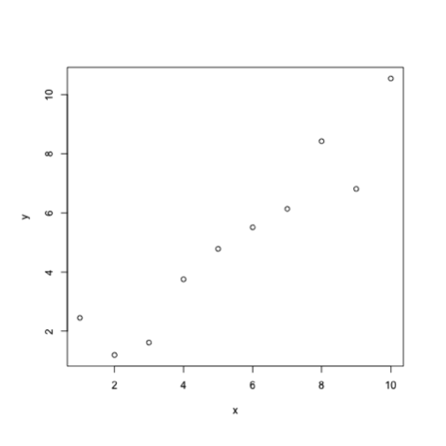

<!-- README.md is generated from README.Rmd. Please edit that file -->

[](http://cran.r-project.org/package=digitize)


digitize : a plot digitizer in R
===============

Get the data from a graph by providing calibration points

## Install

```
if(!require(devtools)) install.packages('devtools')
devtools::install_github("tpoisot/digitize")
```

## How to use it (version 0.0.3 and up)


```r
tmp <- tempfile()
png(tmp)
plot(rnorm(10) + 1:10, xlab="x", ylab="y")
dev.off()
#> quartz_off_screen 
#>                 2

library(digitize)
mydata <- digitize(tmp) ## follow instructions on console
#> ...careful how you calibrate.
#> Click IN ORDER: x1, x2, y1, y2
#> 
#>     Step 1 ----> Click on x1
#>   |
#>   |
#>   |
#>   |
#>   |________x1__________________
#>    
#>     Step 2 ----> Click on x2
#>   |
#>   |
#>   |
#>   |
#>   |_____________________x2_____
#>   
#>  
#>     Step 3 ----> Click on y1
#>   |
#>   |
#>   |
#>   y1
#>   |____________________________
#>   
#>  
#>     Step 4 ----> Click on y2
#>   |
#>   y2
#>   |
#>   |
#>   |____________________________
#>   
#> 
#> What is the value of x1 ?
#> 
#> What is the value of x2 ?
#> 
#> What is the value of y1 ?
#> 
#> What is the value of y2 ?
#> 
#> 
#> 
#> ..............NOW .............
#> 
#> Click all the data. (do NOT press esc!)
#> 
#> Once you are done - right click on the plot area and choose 'Stop'!
#> Error in model.frame.default(formula = c(x1, x2) ~ c(x), drop.unused.levels = TRUE): invalid type (NULL) for variable 'c(x)'
```



## Citation


```r
citation('digitize')
#> 
#>   Poisot, T. The digitize package: extracting numerical data from
#>   scatterplots. The R Journal 3.1 (2011): 25-26.
#> 
#> A BibTeX entry for LaTeX users is
#> 
#>   @Article{,
#>     title = {The digitize package: extracting numerical data from scatterplots},
#>     author = {T. Poisot},
#>     journal = {The R Journal},
#>     year = {2011},
#>     volume = {3},
#>     number = {1},
#>     pages = {25-26},
#>     url = {http://rjournal.github.io/archive/2011-1/RJournal_2011-1.pdf#page=25},
#>   }
```

## Image Types


Works with three bitmap image formats (jpeg, png, bmp), automatically detecting
the image type using package `readbitmap`.

## Earlier versions

Read a [tutorial from Luke Miller](http://lukemiller.org/index.php/2011/06/digitizing-data-from-old-plots-using-digitize/).
